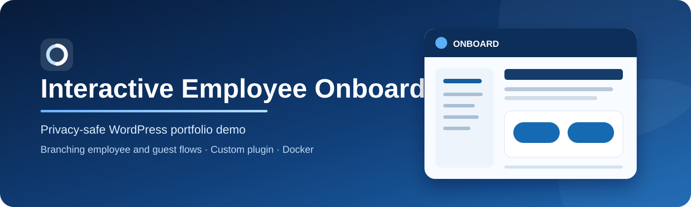
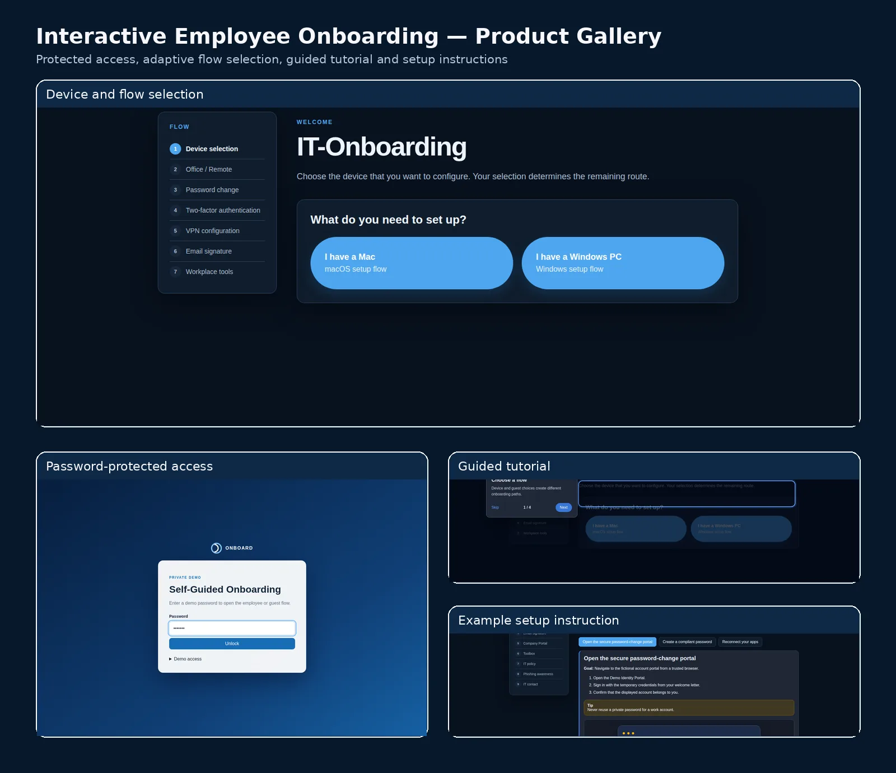
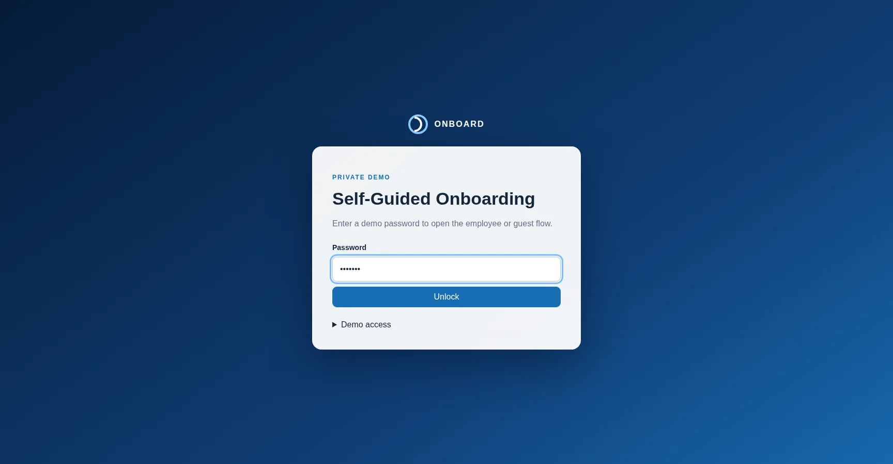
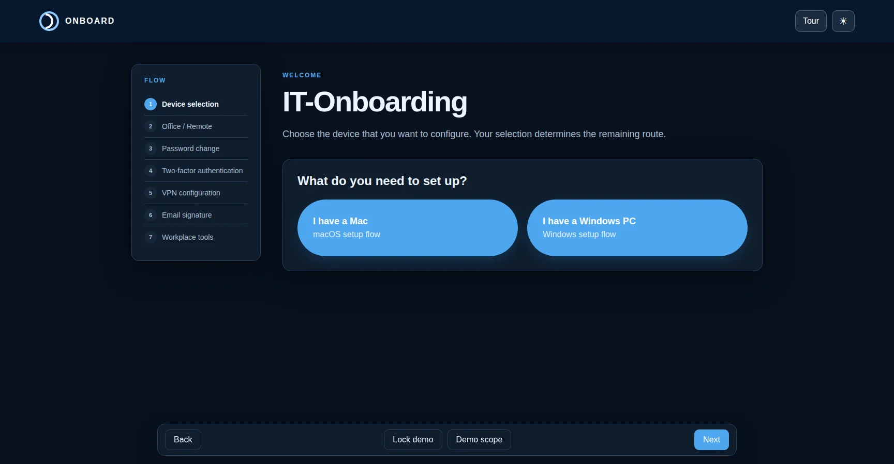
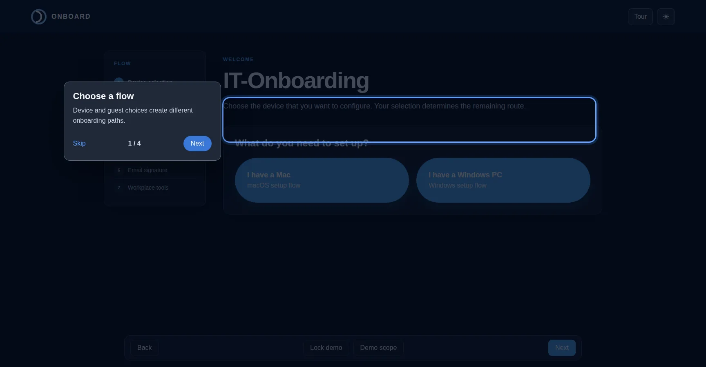
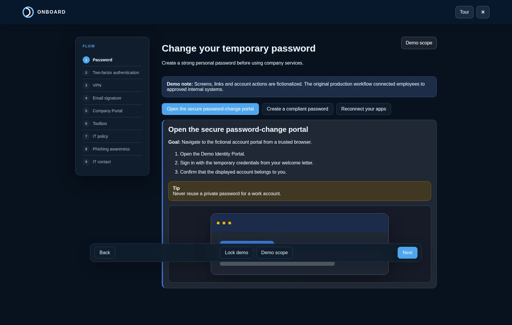
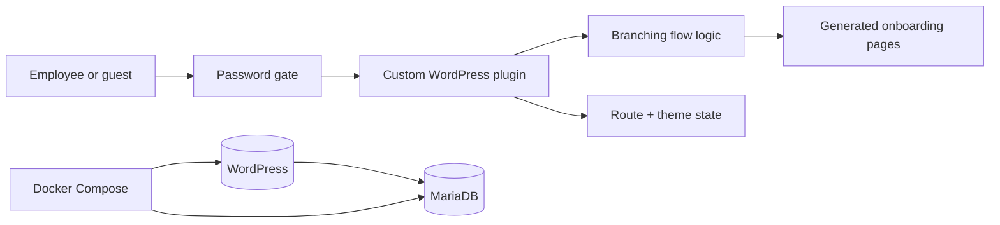

<p align="center">
  
</p>

<p align="center">
  <strong>A privacy-safe WordPress portfolio demo of a guided, self-service IT onboarding flow.</strong>
</p>

<p align="center">
  
  
  
  
  
  
</p>

## Overview

This project transforms presentation-led IT onboarding into a guided website. The flow adapts to the user's account type, device and workplace, remembers route and theme selections in the browser, and presents setup instructions as focused step cards.

The public repository is an **independently rewritten demonstration**. It recreates the product idea, visual language and branching behavior of an internal WordPress solution without publishing employer code, branding, internal links, contacts, credentials, original internal media or confidential instructions.

## Product gallery

<p align="center">
  
</p>

<table>
<tr>
<td width="50%" valign="top"><strong>Protected access</strong><br><br></td>
<td width="50%" valign="top"><strong>Adaptive device selection</strong><br><br></td>
</tr>
<tr>
<td width="50%" valign="top"><strong>Guided tutorial</strong><br><br></td>
<td width="50%" valign="top"><strong>Example setup step</strong><br><br></td>
</tr>
</table>

The screenshots are generated from the public static preview in a clean browser environment. They show only fictional instructions, placeholder portals and synthetic demo content.

## Product experience

- password-protected employee and guest entry paths;
- Mac and Windows branches;
- office and remote-work branches;
- office-dependent ordering of VPN steps;
- browser-persisted device, location and theme selections;
- compact instruction cards and dynamic flow navigation;
- responsive light and dark modes;
- clean guided tutorial and in-app demo-scope disclosure.

The interface intentionally stays close to the original interaction pattern: a dark-blue access page, centered brand area, left-hand flow navigation, classic WordPress content layout, blue choice buttons and a floating Back/Next navigation bar.

## Technical implementation



Key engineering details:

- custom WordPress plugin with automatic page creation;
- PHP rendering and server-side access checks;
- nonce-protected form submission and signed access cookie;
- Vanilla JavaScript state management and branching navigation;
- CSS variables for complete light/dark theming;
- Docker-based WordPress and MariaDB environment;
- PHP, JavaScript and privacy checks in GitHub Actions.

See [Architecture](docs/ARCHITECTURE.md) for the detailed component model.

## Original concept vs. public demo

| Area | Original production concept | Public portfolio demo |
|---|---|---|
| Content | Real internal setup guidance | Fictional and generic instructions |
| Integrations | Internal portals and support paths | Clearly labeled placeholders |
| Password/MFA | Real account actions | Explanatory simulation only |
| VPN/MDM | Real profiles and enrollment | No provisioning or device changes |
| Media | Internal screenshots and videos | Newly generated synthetic demo screenshots; no internal media redistributed |
| Completion/analytics | Environment-dependent | Not included in the current public release |

This separation is deliberate. The repository demonstrates the flow architecture and frontend/backend work while protecting confidential information and employer intellectual property. Read [Production concept vs. demo](docs/PRODUCTION_VS_DEMO.md) and [Feature parity](docs/FEATURE_PARITY.md).

## Run locally

### Windows

1. Start Docker Desktop.
2. Double-click `START_HERE.cmd`.
3. Wait for the browser to open.

### macOS / Linux

```bash
./start-mac-linux.sh
```

### Manual Docker start

```bash
docker compose up -d
```

Open **http://localhost:8081/access/**.

Demo access:

```text
Employee flow: demo123
Guest flow:    guest123
```

Local WordPress administration:

```text
http://localhost:8081/wp-admin/
Username: demo_admin
Password: demo_admin
```

These credentials are for local demonstration only.

## Static preview

The visual layout can be reviewed without WordPress by opening:

```text
preview/access.html
preview/index.html
preview/dark.html
```

The preview is intentionally static. Full routing, cookie handling and page generation run inside WordPress.

## Project structure

```text
interactive-employee-onboarding/
├── assets/
├── docs/
├── preview/
├── screenshots/
├── scripts/
├── wordpress/wp-content/plugins/
│   └── interactive-employee-onboarding-demo/
├── docker-compose.yml
├── START_HERE.cmd
└── README.md
```

## Stability improvements in v1.2.1

- theme changes are bound only to the dedicated theme control;
- the tutorial uses a balanced overlay and centered, viewport-safe dialog;
- tutorial actions use a stable horizontal layout;
- mobile button height and positioning were corrected;
- a new local-storage namespace prevents stale demo settings;
- all missing production capabilities are documented instead of being implied.

## Security and privacy

No production export is included. The repository contains synthetic content only and no usable internal configuration. See [SECURITY.md](SECURITY.md).

## AI-assisted development

AI-assisted coding was used as a productivity tool during the independent portfolio rewrite. Requirements, privacy boundaries, implementation choices and final behavior were manually reviewed.

## License

Released under the [MIT License](LICENSE).
