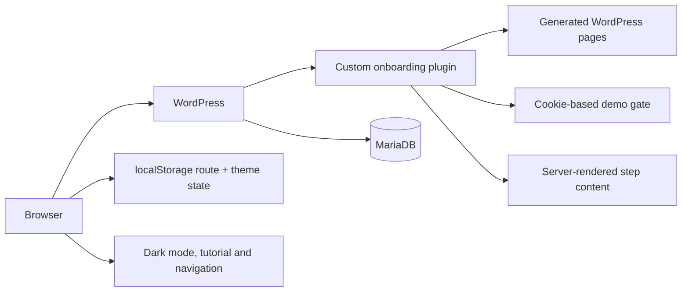

# Architecture

## WordPress layer

The plugin creates the required pages during activation and adds one shortcode to each page. A blank plugin template keeps the public demo portable. Its CSS recreates the original sidebar/content composition and custom flow controls without bundling the production theme or database export.

## Server-side responsibilities

- page creation and route discovery;
- gate form nonce verification;
- HMAC-based local access cookie;
- separation of employee and guest flows;
- content rendering and output escaping;
- registration and versioning of CSS and JavaScript assets.

## Client-side responsibilities

- Mac/Windows and office/remote branching;
- dynamic step order;
- selected device, location, office and theme stored under a namespaced localStorage prefix;
- Back/Next navigation;
- dark-mode preference;
- modal tutorial and public-demo disclosure.

## Data model

The public demo deliberately uses only normal WordPress pages and options. It does not store employee records, credentials, device identifiers or onboarding completion in the database.
